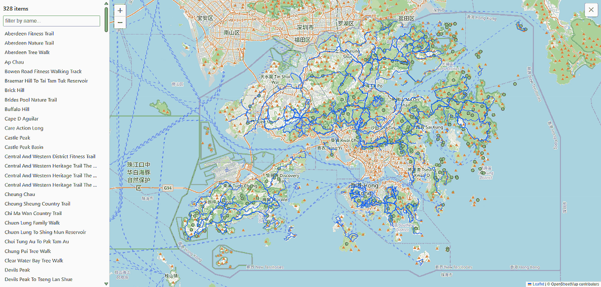

# hktrails

[](https://odinokov.github.io/hktrails)

**325 GPX tracks** covering Hong Kong's hiking trails, nature / country / fitness
trails, heritage walks, cycle tracks, trail-race routes and the LCSD "Hiking Scheme"
routes — plus waypoint layers for the **41 official AFCD campsites**, the **143
highest peaks**, **48 HKUA scuba dive sites**, and **90 outdoor climbing &
bouldering sites**. Ships with `gpx_inspector.py`, a tiny standard-library tool
to browse them on an interactive map with elevation profiles.


## Contents

```
hktrails/
├── maps/              # GPX tracks/routes + waypoint layers (campsites, peaks, dive sites, caves)
├── gpx_inspector.py   # standard-library Leaflet/OSM inspector (works on any GPX)
├── index.html         # prebuilt standalone page — open directly, no server
├── LICENSE
└── README.md
```

## Quick start

Open https://odinokov.github.io/hktrails in a browser — it's a fully self-contained page with all
tracks embedded; no server, no install.

Or run the inspector live:

```bash
python3 gpx_inspector.py maps      # serve ./maps at http://localhost:8000
```

Requires only Python 3 (standard library). Map tiles load from OpenStreetMap, so
*viewing* needs internet; the GPX data itself is embedded in the page.


## Using the GPX files

The `.gpx` files in `maps/` import into any GPS app, watch or handheld. On
**Android we recommend [AlpineQuest](https://www.alpinequest.net/)** for offline
maps + imported tracks/waypoints.


## The inspector

`gpx_inspector.py` works on **any** GPX file or directory, not just this set:

- Renders `<trk>` and `<rte>` as lines and `<wpt>` as markers.
- Click a track for an **elevation profile** — distance, ascent/descent, min/max,
  with a hover probe and click-to-pin on the map. Tick **smooth** to apply
  Savitzky–Golay smoothing.
- Filter by name, hover-to-highlight, collapsible sidebar (mobile-friendly).
- **Show my location** (◉ button) displays your current position on the map.
- Thins dense tracks with Ramer–Douglas–Peucker to keep the page light.
- **Lightweight standalone page:** Embedded GPX data uses delta+quantized encoding.


```bash
python3 gpx_inspector.py track.gpx             # a single file
python3 gpx_inspector.py maps -p 8080          # custom port
python3 gpx_inspector.py maps -o index.html    # rebuild the standalone page
python3 gpx_inspector.py maps --simplify 0     # keep every point (no RDP)
python3 gpx_inspector.py --help                # all options
```

## Elevation data

Track `<ele>` is sampled (bilinear) from the Hong Kong Lands Department
[**5 m grid LiDAR DTM**](https://data.gov.hk/en-data/dataset/hk-landsd-openmap-5m-grid-dtm)
(2010 + 2020 airborne surveys), heights in Hong Kong Principal Datum.


## License

- **Code** (`gpx_inspector.py`) — [MIT](LICENSE).
- **Data** (`maps/*.gpx`):
  - **Trail tracks** — [ODbL 1.0](https://opendatacommons.org/licenses/odbl/1-0/), derived from
    [hikingtrailhk.appspot.com](https://hikingtrailhk.appspot.com/en/search) and maintained under ODbL (share-alike).
  - **LCSD "Hiking Scheme" routes** — sourced from the LCSD [GPX download area](https://www.lcsd.gov.hk/en/healthy/hiking/gpx.html).
  - **Campsites** — data from the Agriculture, Fisheries and Conservation Department [campsite listing](https://www.afcd.gov.hk/).
  - **Peaks** — sourced from [Wikipedia: mountains, peaks and hills in Hong Kong](https://en.wikipedia.org/wiki/List_of_mountains,_peaks_and_hills_in_Hong_Kong).
  - **Scuba sites** — data from the Hong Kong Underwater Association [dive-site guide](https://www.hkua.org.hk/).
  - **Climbing & bouldering sites** — compiled from [hongkongclimbing.com](https://hongkongclimbing.com/),
    [thecrag.com](https://www.thecrag.com/en/climbing/hong-kong), [thetopo.com](https://thetopo.com/),
    OpenStreetMap and Wikipedia.


## Disclaimer

This data is provided as-is, without warranty of any kind, for general reference
only. Waypoints may be inaccurate or mark an approach point rather than the
feature itself; trails, crags and access arrangements change. Hiking, climbing
and diving are dangerous — verify conditions and access on the ground, use an
up-to-date guidebook, and proceed at your own risk.